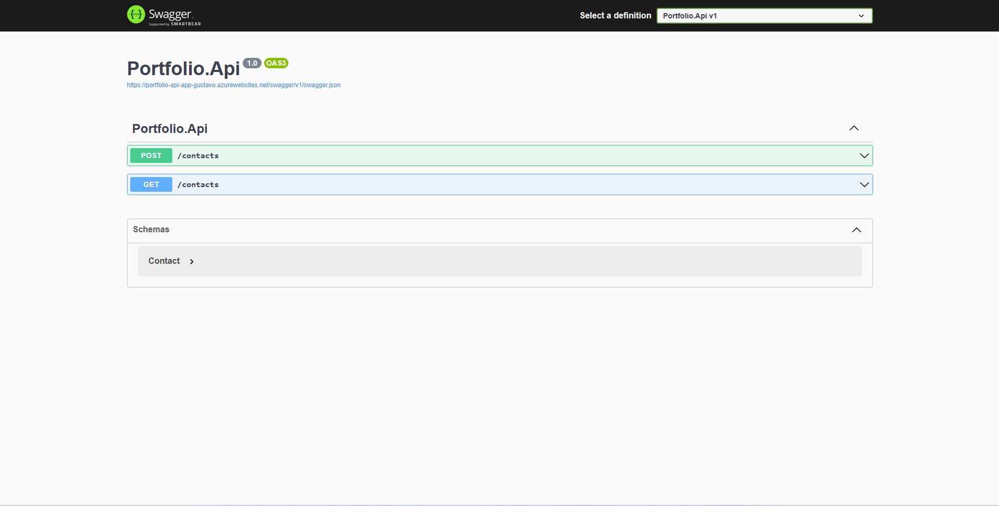

<h1 align="center">
    
</h1>

 <a href="#-sobre-o-projeto">Sobre</a> •
 <a href="#-funcionalidades">Funcionalidades</a> •
 <a href="#-tecnologias">Tecnologias</a> • 
 <a href="#-autor">Autor</a> • 
 <a href="#user-content--licença">Licença</a>

  

## 💻 Sobre o projeto ##

O Portfolio .NET Minimal APIs trata-se de uma API para receber contatos através de um formulário dentro do site.

---

## ⚙️ Funcionalidades

- [x] Registra nome de possíveis contatos / leads.
- [x] Registra e-mail para um possível retorno.
- [x] Registra a mensagem digitada pelo contato / lead.
- [x] Cadastro e alteração de funcionários.
---

## 🛠 Tecnologias

As seguintes ferramentas foram usadas na construção do projeto:

#### **Server**  ([.NET](https://dotnet.microsoft.com/))

-   **[ASP.NET Core](https://learn.microsoft.com/aspnet/core/?view=aspnetcore-7.0)**
-   **[Minimal APIs](https://www.microsoft.com/sql-server/sql-server-2022)**
-   **[SQL Server](https://www.microsoft.com/sql-server/sql-server-2022)**

#### **Utilitários**

-   SQL Server Management Studio:  **[SQL Server Management Studio](https://learn.microsoft.com/en-us/sql/ssms/download-sql-server-management-studio-ssms?view=sql-server-ver16)**
-   Swagger:  **[Swagger](https://swagger.io/)**

---

## 🦸 Autor

<a href="https://github.com/gustavoferreiradev">
 
  
 <b>Gustavo Ferreira</b></a> <a href="https://github.com/gustavoferreiradev/" title="Gustavo Ferreira">🚀</a>
  
 
 
 

---

## 📝 Licença

Este projeto esta sobe a licença [MIT](./LICENSE).

Feito com ❤️ por Gustavo Fereira 👋🏽 [Entre em contato!](https://www.linkedin.com/in/gustavofersilva/)

